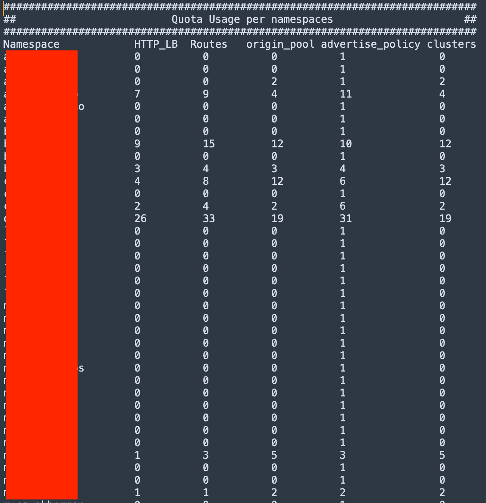
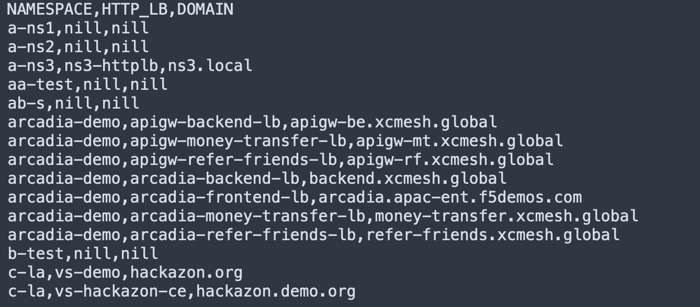
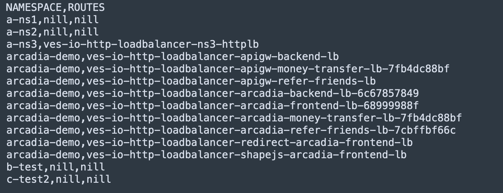
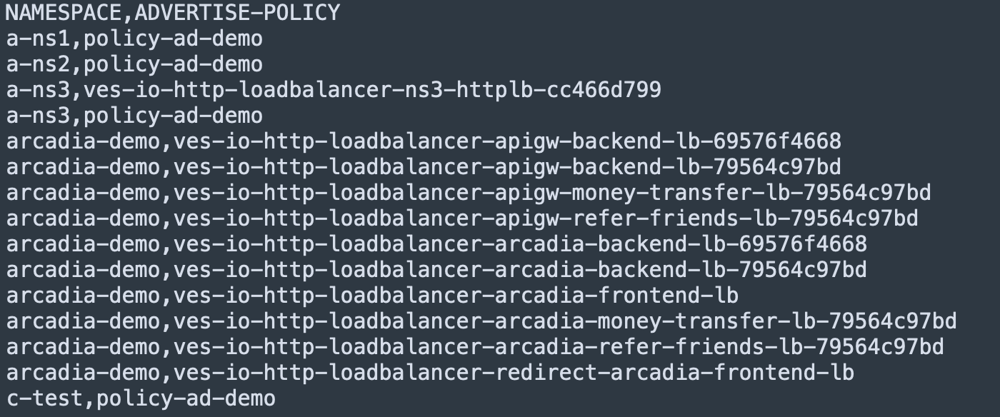

# F5XC Resource Query
This script assist tenant administror to simplify operation of resources/quota management. Find out which namespaces consuming those quota allocated and global view (export to CSV format) on configuration information. It helps in resource clean up.

### Common Use Cases

1. What are the distributions of quota usage of those allocated resources - http_lb, virtual_host, route, advertise_policy, clusters and etc?
2. Which namespaces consume most of those allocated quota?
3. I am trying to use this FQDN and it block me from using as it reported conflict. Someone been using the same FQDN. How I know who using the same FQDN?
4. How I do periodic (schedule daily/monthly/etc) monitor quota usage and alert when some namespaces exceed what I allow them to use? (Not supported yet but easy to add)
5. I only bought 10 HTTP LB. How can I make sure my developer don't exceed what I bought or at least alert me? Similar above.
6. I want a global view/dump of all the HTTP_LB, Routes, advertise policy and etc information into a csv to analyze.

##### Note:
- Supported quota information
  - http_loadbalancers
  - routes
  - origin_pools
  - advertise_policys
  - clusters

###### Please updates the tenantID and the API Key inside the python script before you run.
> tenant_url = 'https://--your-tenant-id--.console.ves.volterra.io'
> api_token = 'xxxxxxx' # API token for xxxxx

##### Usage
> usage: f5xc-resource-query.py [-h] [-r RESOURCES]
> 
> optional arguments:
>   -h, --help            show this help message and exit
>   -r RESOURCES, --resources RESOURCES
>                         Type of resource - http_lb / routes / origin_pool /advertise_policy / clusters
>  
> 
By default, when no resource specifiy, default output to resource usage.
##### Sample output
~ ./f5xc-resource-query.py

~ ./f5xc-resource-query.py -r http_lb

~ ./f5xc-resource-query.py -r routes

~ ././f5xc-resource-query.py -r advertise_policy

